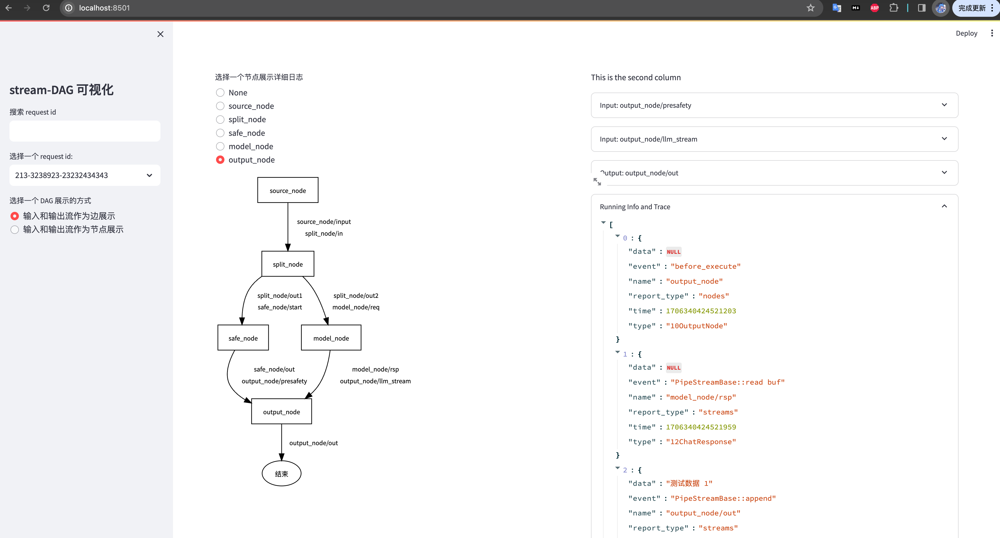

# Stream-DAG 框架
设计文档请参考 https://cq6qe6bvfr6.feishu.cn/docx/G4oTdOo5fol8k9x16hicdvrdncc

## 项目简介
当前业界的 DAG 框架，如 cpp-taskflow、cgraph等，都是在一个节点运行结束后运行下一个节点。
然而大模型业务场景下，由于模型输出效率限制无法一次性输出全部结果，往往处理的模式是模型边输出边处理。
大模型的特殊场景下，为了支持流程编排、业务逻辑解耦合、方便开发和调试等重要的主题，开发这个框架来更好支持业务迭代。
为此，我们基于 brpc 开发了一个处理流式数据的 DAG 框架，支持以下功能：
1. 支持节点输入输出**流式**数据，而不是一次性输出全部数据。
2. 支持节点并行执行。
3. 支持通过 web 界面查看 DAG 图、获取执行的 trace 信息。


## 快速开始

创建一个节点:
```C++

class OutputNode : public BaseNode {
public:
    Status run(Stream<SafetyStatus>& presafety, Stream<ChatResponse>& llm_stream, Stream<Response>& out) {
        while (true) {
            auto [safe_data, llm_data] = when_any(presafety, llm_stream);
            if (safe_data && safe_data->status == SafetyStatus::kBlock) {
                out.append(Response("blocked!"));
                return Status::OK();
            } else if (llm_data) {
                out.append(Response(llm_data->msg));
                continue;
            } else {
                break;
            }
        }
        out.append(Response("end"));

        return Status::OK();
    }

    ENGINE_INPUT(presafety, SafetyStatus);
    ENGINE_INPUT(llm_stream, ChatResponse);
    ENGINE_OUTPUT(out, Response);
};
REGISTER_CLASS(OutputNode);
```
编排
```json
{
    "edges": [
        {
            "from": "model_node/rsp",
            "to": "output_node/llm_stream"
        },
        {
            "from": "split_node/out2",
            "to": "model_node/req"
        },
        {
            "from": "split_node/out1",
            "to": "safe_node/start"
        },
        {
            "from": "source_node/input",
            "to": "split_node/in"
        },
        {
            "from": "safe_node/out",
            "to": "output_node/presafety"
        }
    ],
    "nodes": [
        {
            "name": "source_node",
            "outputs": [
                "source_node/input"
            ],
            "type": "6Source"
        },
        {
            "inputs": [
                "split_node/in"
            ],
            "name": "split_node",
            "outputs": [
                "split_node/out1",
                "split_node/out2"
            ],
            "type": "5Split"
        },
        {
            "inputs": [
                "safe_node/start"
            ],
            "name": "safe_node",
            "outputs": [
                "safe_node/out"
            ],
            "type": "9PreSafety"
        },
        {
            "inputs": [
                "model_node/req"
            ],
            "name": "model_node",
            "outputs": [
                "model_node/rsp"
            ],
            "type": "8LLMModel"
        },
        {
            "inputs": [
                "output_node/presafety",
                "output_node/llm_stream"
            ],
            "name": "output_node",
            "outputs": [
                "output_node/out"
            ],
            "type": "10OutputNode"
        }
    ]
}
```
运行
```C++
#include "my_node.h"

int main(int argc, char *argv[]) {
    auto t1 = std::chrono::high_resolution_clock::now();
    // 加载
    StreamGraph g;
    g.load("./graph.json");

    BaseContext ctx;
    BthreadExecutor executor;
    auto status = executor.run(g, ctx);

    auto t2 = std::chrono::high_resolution_clock::now();
    std::chrono::duration<double, std::milli> ms_double = t2 - t1;
    printf("run fin cost %lfms \n", ms_double);
    return 0;
}

```

## 可视化结果
运行时可以选择开启 trace。结果保存后可以在浏览器打开可视化 trace 结果.


## Benchmark
性能评测使用的图是上面的图。

| 测试场景 | 测试结果 | 命令和参数 |
| --- | --- | --- |
| 串行执行 10000 次，10 线程 | 共耗时2870ms 平均耗时0.287ms | `benchmark --both_run  --loop_cnt 10000 --trace=false -bthread_concurrency=10` |
| 并行执行 10000 次，10 线程 | 共耗时543ms 平均耗时0.054ms | `benchmark --paralize_exe  --loop_cnt 10000 --trace=false -bthread_concurrency=10` |
| 并行执行 10000 次，20 线程 | 共耗时280ms 平均耗时0.028ms | `benchmark --paralize_exe  --loop_cnt 10000 --trace=false -bthread_concurrency=20` |
| 并行执行 10000 次，30 线程 | 共耗时246ms 平均耗时**0.025ms** | `benchmark --paralize_exe  --loop_cnt 10000 --trace=false -bthread_concurrency=30` |
| 串行执行 10000 次，10 线程，开启 trace | 共耗时9091ms 平均耗时0.909ms | `benchmark --both_run  --loop_cnt 10000 --trace=true -bthread_concurrency=10` |
| 并行执行 10000 次，10 线程，开启 trace | 共耗时2072ms 平均耗时0.207ms | `benchmark --paralize_exe  --loop_cnt 10000 --trace=false -bthread_concurrency=10` |

## 后续计划
- 支持输入和输出为非 Stream 的节点
- 支持节点依赖而不是只有数据依赖
- 支持通过声明名称同样的字段隐式自动依赖(放弃必须显式连接两个节点的依赖)
- 支持 web 端可视化编排 DAG bpmn
- 支持 lazy 模式创建节点和运行
- 支持 Stream 多写多读
- 支持子图、动态图、动态调用节点
